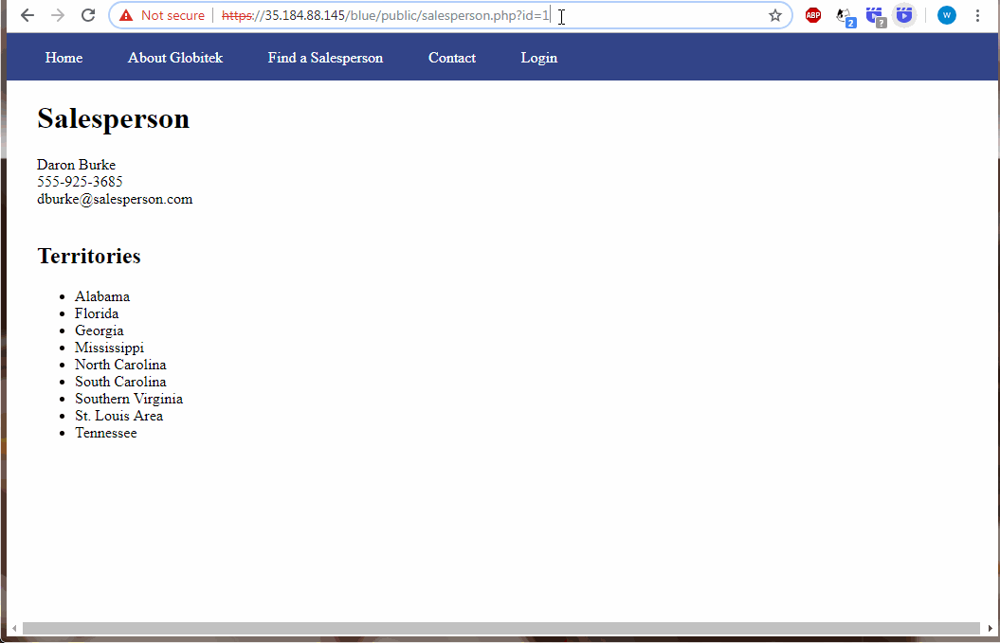
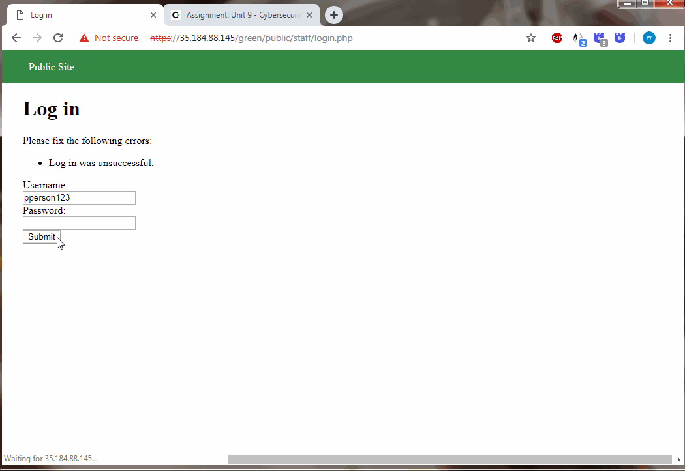
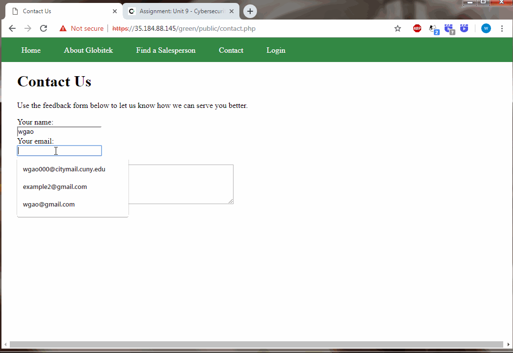
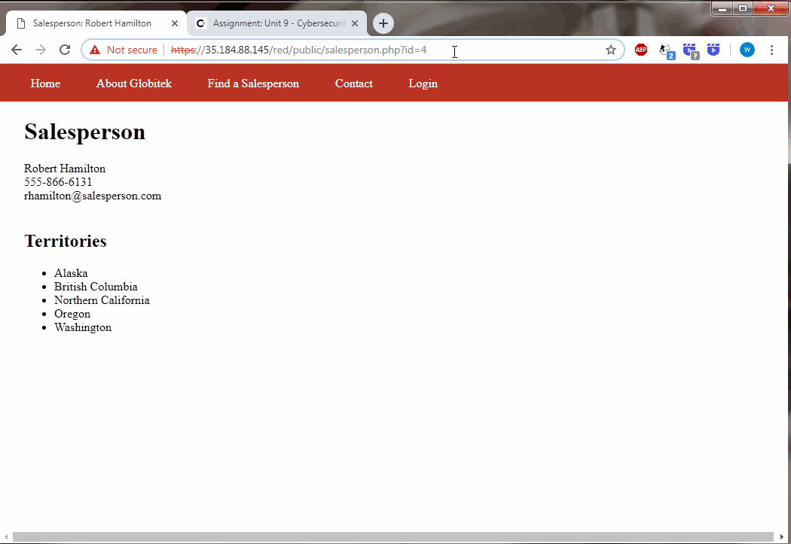

# Cybersecurity-WEEK-9-Social-Engineering

Time spent: 7 hours spent in total

> Objective: Identify vulnerabilities in three different versions of the Globitek website: blue, green, and red.

The six possible exploits are:
* Username Enumeration
* Insecure Direct Object Reference (IDOR)
* SQL Injection (SQLi)
* Cross-Site Scripting (XSS)
* Cross-Site Request Forgery (CSRF)
* Session Hijacking/Fixation

Each version of the site has been given two of the six vulnerabilities.

----------------------------------------------------------------------------------------------------------------------------------------
## Blue

Vulnerability #1: Session Hijacking/Fixation
- Summary: By using a PHP script that is provided by the codepath ("public/hacktools/change_session_id.php") to catch session id from a browser with logged in account, copy the session and set it into another brower without logged account, then in that browser it will be automatically logged in.
- GIF: 
  - 
  
  Vulnerability #2: SQL Injection: 
- Summary: In the salesperson page is vunlerable about SQLi that it will return one salesperson page which id greater than 1 if we change the id into the 'OR id > 1 --'; (Or ' OR id = 5 --' ; it will return salesperson page which id is 5).
- GIF: 
  -  

----------------------------------------------------------------------------------------------------------------------------------------
## Green

Vulnerability #1: User Enumeration
- Summary: user account exists vs. user account not exists
           The error return of loggin in will be bold error message (##Log in was unsuccessful) if the account exists, otherwise the                error return of loggin in will be normal error message.
- GIF: 
  - 

Vulnerability #2: XSS
- Summary: Attacker can inject users' feedback form by added JS script into Contact us page.
           Injected XSS Command: 
- GIF: 
  -  

----------------------------------------------------------------------------------------------------------------------------------------
## Red

Vulnerability #1: Insecure Direct Object Reference
- Summary: Attacker can illegal access to the user's accounts which not allow access without permit. As git shows, in Salesperson page              attacker can modify the "id=X". If setting X to be 10 or 11, it will return one salesperson page of two salespersons that did            not show in Find a Salesperson page.
- GIF: 
  - 

Vulnerability #2: Cross Site Request Fogery
- Summary: The correct csrf token allow user send a POST request. However, the incorrect csrf token also allow user send a POST request,            which ignores the CSRF token.
- GIF: 
  - 

## Notes

N/A
